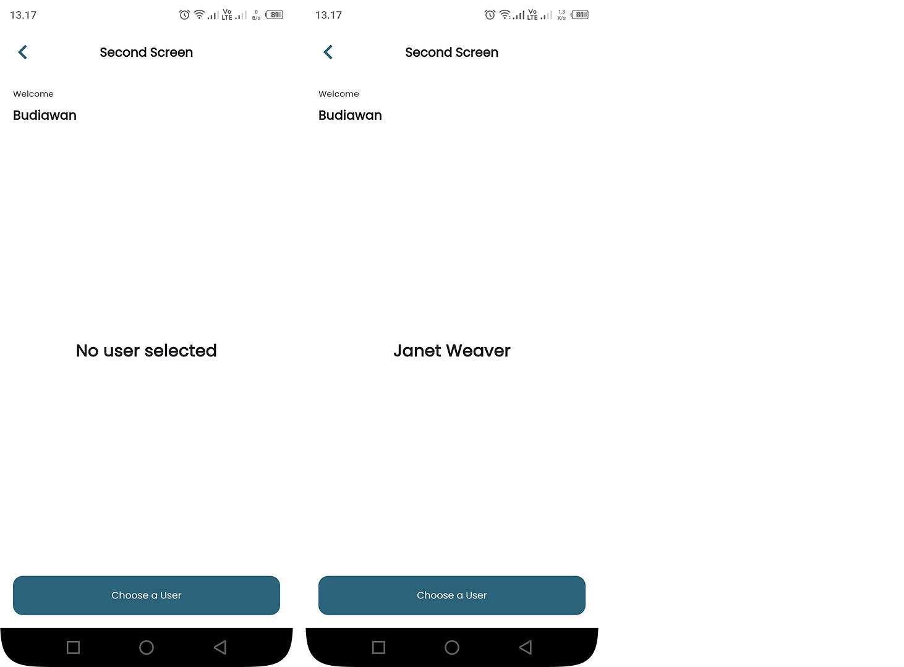

# **Suitmedia Test App**

Aplikasi ini dibuat menggunakan **Flutter 3.24.5** dengan state management **GetX**. Aplikasi ini terdiri dari 3 layar dengan fungsionalitas sebagai berikut:

---

## **Fitur Aplikasi**

### **1. First Screen**

- **Input Nama**: Pengguna dapat memasukkan nama mereka.
- **Input Kalimat**: Pengguna dapat memasukkan kalimat untuk memeriksa apakah kalimat tersebut adalah palindrome.
- **Tombol "Check"**:
  - Menampilkan dialog dengan pesan:
    - `"isPalindrome"` jika kalimat adalah palindrome.
    - `"not palindrome"` jika kalimat bukan palindrome.
- **Tombol "Next"**:
  - Mengarahkan pengguna ke **Second Screen**.

#### **Contoh Palindrome**:

- `isPalindrome("kasur rusak")` -> `true`
- `isPalindrome("step on no pets")` -> `true`
- `isPalindrome("put it up")` -> `true`
- `isPalindrome("suitmedia")` -> `false`

---

### **2. Second Screen**

- **Teks "Welcome"**: Teks statis yang menampilkan pesan selamat datang.
- **Nama Pengguna**: Menampilkan nama yang dimasukkan di **First Screen**.
- **Selected User Name**: Menampilkan nama pengguna yang dipilih dari **Third Screen**.
- **Tombol "Choose a User"**:
  - Mengarahkan pengguna ke **Third Screen** untuk memilih pengguna.

---

### **3. Third Screen**

- **Daftar Pengguna**: Menampilkan daftar pengguna dari API [reqres.in](https://reqres.in/).
  - Data yang ditampilkan: `email`, `first_name`, `last_name`, dan `avatar`.
- **Pull to Refresh**: Memuat ulang data pengguna.
- **Load More**: Memuat halaman berikutnya saat pengguna menggulir ke bagian bawah daftar.
- **Empty State**: Menampilkan pesan jika data pengguna kosong.
- **Pilih Pengguna**:
  - Ketika pengguna memilih item dari daftar, **Selected User Name** di **Second Screen** akan diperbarui dengan nama pengguna yang dipilih.

---

## **Struktur Proyek**

```
lib/
|-- app/
|   |-- modules/
|   |   |-- first_screen/
|   |   |   |-- bindings/
    |   |   |   |--  first_screen_binding.dart
|   |   |   |-- controllers
    |   |   |   |--  first_screen_controller.dart
|   |   |   |-- pages
    |   |   |   |--  first_screen_page.dart
|   |   |-- second_screen/
|   |   |   |-- bindings/
    |   |   |   |--  second_screen_binding.dart
|   |   |   |-- controllers
    |   |   |   |--  second_screen_controller.dart
|   |   |   |-- pages
    |   |   |   |--  second_screen_page.dart
|   |   |-- third_screen/
|   |   |   |-- bindings/
    |   |   |   |--  third_screen_binding.dart
|   |   |   |-- controllers
    |   |   |   |--  third_screen_controller.dart
|   |   |   |-- pages
    |   |   |   |--  third_screen_page.dart
|   |-- routes/
|   |   |-- app_pages.dart
|   |   |-- app_routes.dart
|-- core/
|   |-- services/
|   |   |-- api_service.dart
|   |-- models/
|   |   |-- user_model.dart
|-- main.dart
```

---

## **Teknologi yang Digunakan**

- **Flutter 3.24.5**: Framework untuk membangun aplikasi cross-platform.
- **GetX**: State management dan navigasi.
- **Google Fonts**: Menggunakan font **Poppins** dari Google Fonts.
- **HTTP**: Untuk mengambil data dari API [reqres.in](https://reqres.in/).

---

## **Cara Menjalankan Proyek**

1. **Clone Repository**:

   ```bash
   git clone https://github.com/yondikavl/mdintern_test_suitmedia.git
   cd mdintern_test_suitmedia
   ```

2. **Instal Dependencies**:

   ```bash
   flutter pub get
   ```

3. **Jalankan Aplikasi**:

   ```bash
   flutter run
   ```

4. **Build Aplikasi**:
   - Untuk Android:
     ```bash
     flutter build apk
     ```
   - Untuk iOS:
     ```bash
     flutter build ios
     ```

---

## **Screenshot Aplikasi**

Berikut adalah beberapa screenshot dari aplikasi:

### **First Screen**


### **Second Screen**



### **Third Screen**


---

## **Kontak**

Jika Anda memiliki pertanyaan atau masukan, silakan hubungi:

- **Nama**: Yondika Vio Landa
- **Email**: yondikaviolanda@gmail.com
- **GitHub**: [yondikavl](https://github.com/yondikavl)

---

**Terima kasih telah menggunakan aplikasi ini!** 😊

---

### **Catatan**

- Pastikan Anda telah menginstal Flutter dan Dart SDK sebelum menjalankan proyek.
- Pastikan perangkat atau emulator Anda terhubung ke internet untuk mengunduh font dari Google Fonts dan mengambil data dari API.
